# Last.fm Charts, Data Pipeline

> **Projeto de modernização de um pipeline de dados musical.**
> O projeto original era um script monolítico local que gerava rankings semanais de músicas entre um grupo de amigos via Last.fm. Este repositório representa a evolução: uma arquitetura de dados em camadas (Medallion), com ingestão estruturada, transformações documentadas e persistência em banco de dados relacional.

---

## Contexto

O projeto nasceu como uma automação pessoal em 2022: toda semana, um script era executado manualmente para coletar os scrobbles (as músicas escutadas) do grupo via API do Last.fm e gerava um ranking de artistas, músicas e usuários em um arquivo Excel formatado, que era compartilhado no grupo.

Funcionava, mas era frágil. Tudo rodava localmente em uma única máquina, sem separação de responsabilidades, sem versionamento de dados, sem documentação e com dependências desatualizadas. Qualquer mudança pequena quebrava o fluxo inteiro.

**Este projeto reescreve essa base do zero**, aplicando conceitos modernos de engenharia de dados:

| | Projeto Anterior | Projeto Atual |
|---|---|---|
| Estrutura | Script monolítico único | 3 camadas independentes (Bronze → Silver → Gold) |
| Armazenamento | Arquivos Excel locais | JSON/CSV (Bronze) + Parquet (Silver) + PostgreSQL (Gold) |
| Coleta de dados | `pylast` (wrapper) | `requests` direto com paginação e retry |
| Resiliência |  | Checkpoint por usuário, retoma de onde parou |
| Dependências | `pylast`, `openpyxl` desatualizados | Stack moderna: `pandas 2.x`, `sqlalchemy 2.x`, `pyarrow` |
| Credenciais | Armazenadas no script | Variáveis de ambiente via `.env` |
| Modelagem |  | Star Schema no PostgreSQL |
| Documentação |  | README, dicionário de dados, relatório de qualidade automático |
| Portabilidade | Máquina da autora | Docker |
| Tipagem de datas | `Day` e `Time` como strings brutas | 10 colunas de tempo extraídas corretamente |
| Tratamento de erros |  | Retry automático para erros 5xx da API |

---

## Observações Acadêmicas

**Sobre a complexidade do projeto:**
Este projeto pode aparentar uma complexidade acima do esperado para um trabalho introdutório. Isso se deve ao fato de que a ideia central, coletar e rankear scrobbles de um grupo de amigos via Last.fm, já existia em um projeto pessoal anterior. O que foi feito aqui foi uma **modernização e reestruturação** dessa base, aplicando os conceitos do laboratório (Arquitetura Medallion, PostgreSQL, documentação) sobre algo que já tinha lógica de negócio estabelecida. Além disso, a ideia é reaproveitar o projeto como portfólio.

**Sobre o volume de dados:**
A API do Last.fm limita a coleta a **200 scrobbles por requisição**. Para atingir o requisito de 1 milhão de linhas, foi necessário coletar o histórico completo de cada usuário, paginando requisição por requisição com um intervalo de 0.1s entre cada chamada para respeitar o rate limit da API. O processo completo levou **algumas horas** de execução contínua, com um sistema de checkpoint implementado para retomar a coleta em caso de interrupção.

---

## Arquitetura

```
Last.fm API
    │
    ▼
┌─────────────┐
│   BRONZE    │  Ingestão raw, dados exatamente como a API retorna
│data/bronze/ │  JSON por usuário + CSV consolidado
└──────┬──────┘
       │
       ▼
┌─────────────┐
│   SILVER    │  Técnicas de transformação de dados
│data/silver/ │  Parquet + relatório de qualidade (.md)
└──────┬──────┘
       │
       ▼
┌─────────────┐
│    GOLD     │  Star Schema no PostgreSQL
│  PostgreSQL │  5 dimensões + tabela fato + métricas de negócio
└─────────────┘
```

---

## Estrutura do Repositório

```
lastfm-charts/
├── data/
│   ├── bronze/
│       ├── bronze.csv                                  # CSV consolidado
│       ├── {usuario}.json                              # JSONs por usuário
│       └── checkpoint.json                             # Checkpoint para retomada em caso de erro
│   └── silver/
│       ├── scrobbles.parquet                           # Dado limpo
│       ├── silver_report.md                            # Relatório de qualidade automático
│       └── graphs/                                     # Gráficos de exemplo gerados
├── src/
│   ├── bronze.py                                       # Camada Bronze
│   ├── silver.py                                       # Camada Silver
│   └── gold.py                                         # Camada Gold
├── .env                                                # Credenciais (não versionado)
├── .env.example
├── .gitignore
├── docker-compose.yml
├── Dockerfile
├── requirements.txt
└── README.md
```

---

## Documentação das Etapas

### Subindo a aplicação com Docker

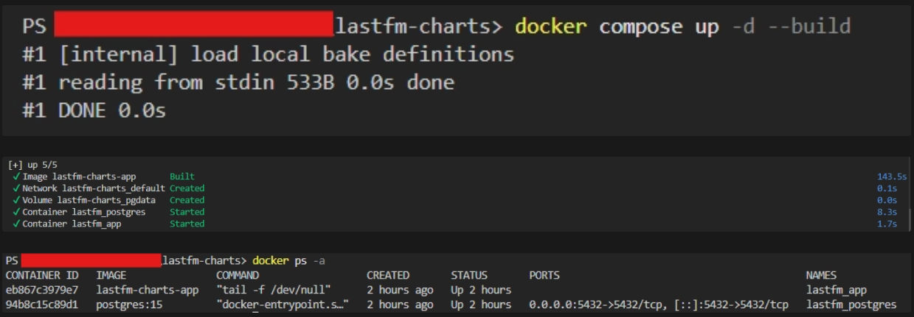

### Etapa Bronze

A Bronze coleta os scrobbles de cada usuário via API do Last.fm e salva os dados sem alteração, exatamente como a API retorna. Cada usuário gera um JSON individual, e ao final todos são consolidados em um CSV.

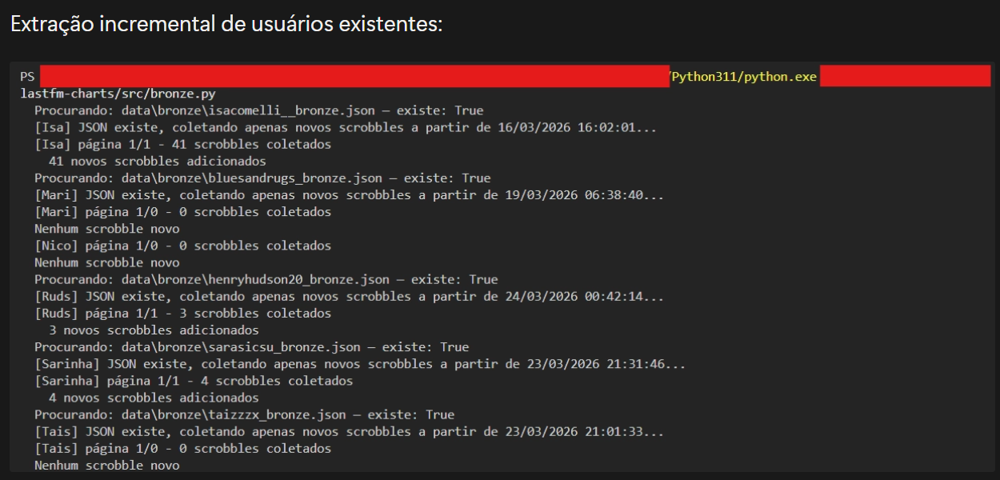

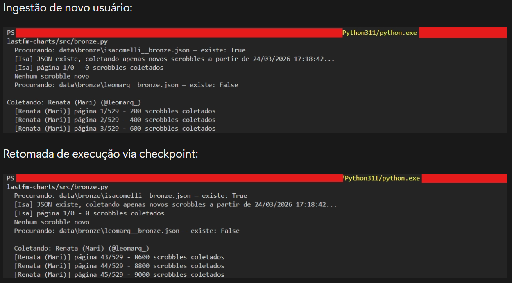

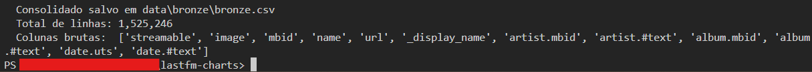

### Etapa Silver

A camada Silver consome os dados da Bronze, aplica transformações e persiste os dados em formato Parquet. 
Além disso, gera automaticamente um relatório de qualidade com estatísticas descritivas e visualizações.

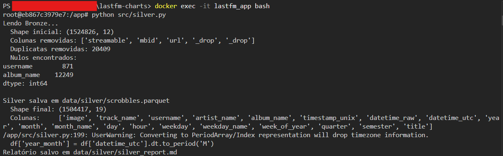


### Etapa Gold

A Gold lê o Parquet da Silver, cria o Star Schema no PostgreSQL, carrega todas as dimensões, a tabela fato e as métricas de negócio.

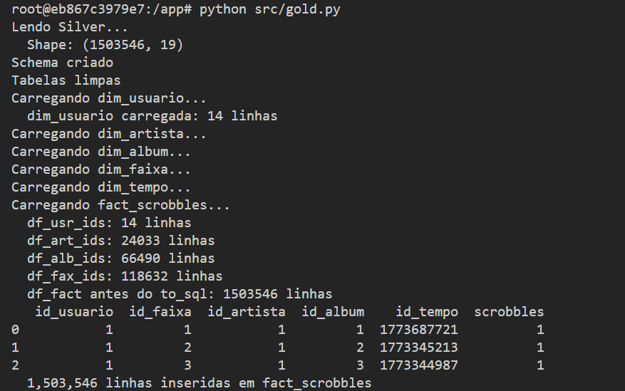

---

#### Métricas de Negócio

As 5 queries implementadas em `gold.py` respondem às seguintes perguntas:

1. **Ranking geral de artistas**, quais artistas têm mais scrobbles somados no grupo?

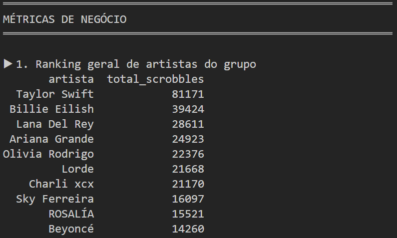

2. **Quem mais escutou**, ranking dos usuários por total de scrobbles

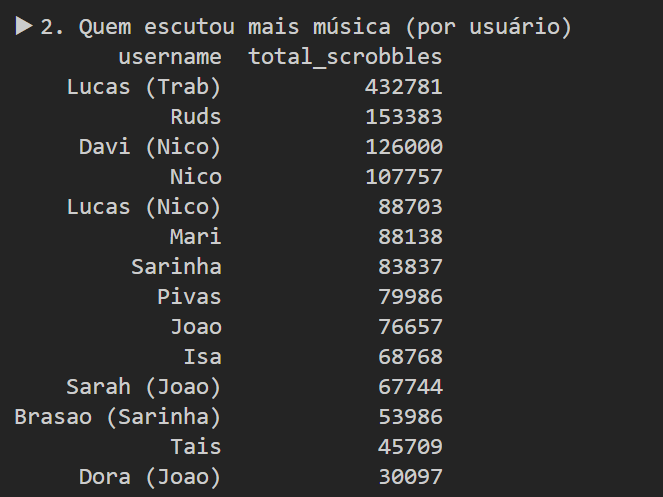

3. **Artista favorito por usuário**, artista mais escutado individualmente por cada membro

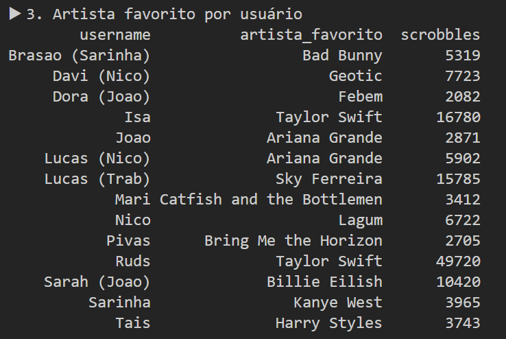

4. **Hora do dia com mais scrobbles**, em qual horário o grupo mais escuta música?

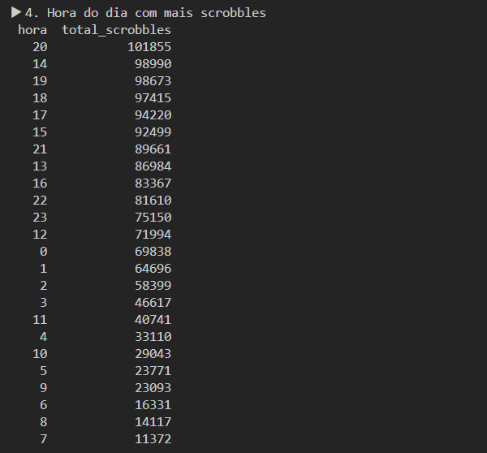

5. **Top 10 faixas**, as músicas mais tocadas no histórico completo do grupo

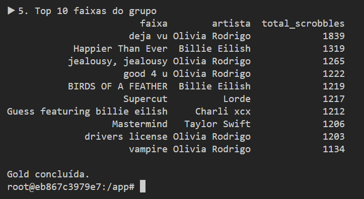

### Etapa PostgreSQL

Os dados do PostgreSQL podem ser visualizados através do DBeaver:

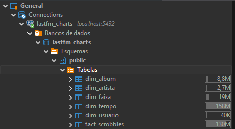

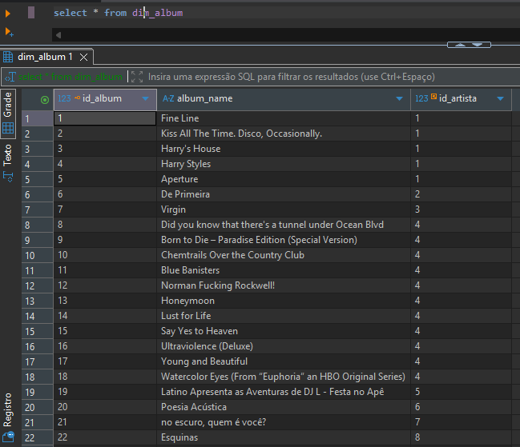

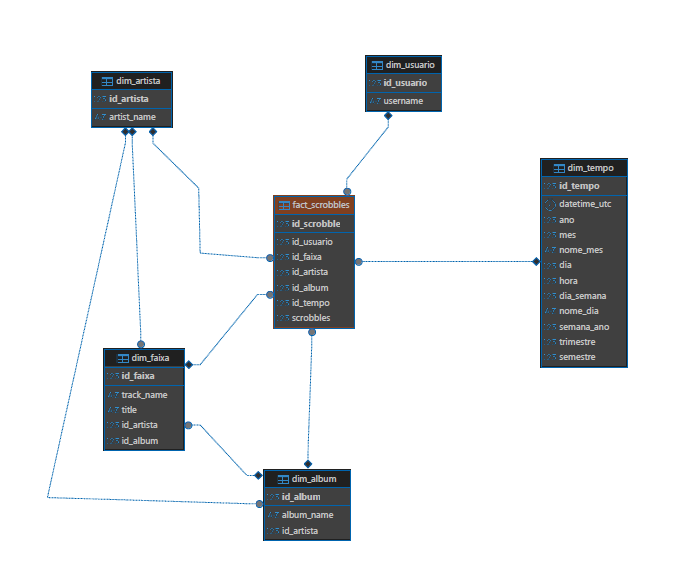

---

## Dicionário de Dados

### Bronze (`data/bronze/bronze.csv`)
Campos brutos retornados pela API do Last.fm, sem alteração.

| Coluna | Tipo | Descrição |
|---|---|---|
| `name` | string | Nome da música |
| `artist.#text` | string | Nome do artista |
| `album.#text` | string | Nome do álbum |
| `date.uts` | string | Timestamp Unix do scrobble |
| `date.#text` | string | Data/hora legível retornada pela API |
| `_display_name` | string | Nome de exibição do usuário no grupo (adicionado na coleta) |
| `mbid` | string | MusicBrainz ID da faixa |
| `url` | string | URL da faixa no Last.fm |
| `image` | array | URLs das imagens do álbum |
| `streamable` | string | Flag de streamable da API |

### Silver (`data/silver/scrobbles.parquet`)
Dado limpo, padronizado e enriquecido.

| Coluna | Tipo | Descrição |
|---|---|---|
| `username` | string | Nome de exibição do usuário |
| `track_name` | string | Nome da faixa (padronizado) |
| `artist_name` | string | Nome do artista (padronizado) |
| `album_name` | string | Nome do álbum (padronizado) |
| `title` | string | `track_name - artist_name` (legado) |
| `timestamp_unix` | int64 | Timestamp Unix do scrobble |
| `datetime_utc` | datetime | Data e hora em UTC |
| `year` | int | Ano do scrobble |
| `month` | int | Mês do scrobble (1–12) |
| `month_name` | string | Nome do mês (January, February...) |
| `day` | int | Dia do mês |
| `hour` | int | Hora do dia (0–23) |
| `weekday` | int | Dia da semana (0=Monday) |
| `weekday_name` | string | Nome do dia (Monday, Tuesday...) |
| `week_of_year` | int | Semana do ano (1–53) |
| `quarter` | int | Trimestre (1–4) |
| `semester` | int | Semestre (1–2) |

### Gold (PostgreSQL)

**`dim_usuario`**
| Coluna | Tipo | Descrição |
|---|---|---|
| `id_usuario` | serial PK | Identificador único |
| `username` | varchar | Nome de exibição do usuário |

**`dim_artista`**
| Coluna | Tipo | Descrição |
|---|---|---|
| `id_artista` | serial PK | Identificador único |
| `artist_name` | varchar | Nome do artista |

**`dim_album`**
| Coluna | Tipo | Descrição |
|---|---|---|
| `id_album` | serial PK | Identificador único |
| `album_name` | varchar | Nome do álbum |
| `id_artista` | int FK | Referência ao artista |

**`dim_faixa`**
| Coluna | Tipo | Descrição |
|---|---|---|
| `id_faixa` | serial PK | Identificador único |
| `track_name` | varchar | Nome da faixa |
| `title` | varchar | `track_name - artist_name` |
| `id_artista` | int FK | Referência ao artista |
| `id_album` | int FK | Referência ao álbum |

**`dim_tempo`**
| Coluna | Tipo | Descrição |
|---|---|---|
| `id_tempo` | bigint PK | Timestamp Unix |
| `datetime_utc` | timestamptz | Data e hora em UTC |
| `ano` | smallint | Ano |
| `mes` | smallint | Mês |
| `nome_mes` | varchar | Nome do mês |
| `dia` | smallint | Dia |
| `hora` | smallint | Hora |
| `dia_semana` | smallint | Dia da semana |
| `nome_dia` | varchar | Nome do dia |
| `semana_ano` | smallint | Semana do ano |
| `trimestre` | smallint | Trimestre |
| `semestre` | smallint | Semestre |

**`fact_scrobbles`**
| Coluna | Tipo | Descrição |
|---|---|---|
| `id_scrobble` | serial PK | Identificador único |
| `id_usuario` | int FK | Referência ao usuário |
| `id_faixa` | int FK | Referência à faixa |
| `id_artista` | int FK | Referência ao artista |
| `id_album` | int FK | Referência ao álbum |
| `id_tempo` | bigint FK | Referência ao timestamp |
| `scrobbles` | smallint | Quantidade (sempre 1 por evento) |


---

## Qualidade de Dados

O relatório completo é gerado automaticamente em `data/silver/silver_report.md` ao rodar a Silver. Problemas identificados durante o desenvolvimento:

| Problema | Coluna | Impacto | Tratamento |
|---|---|---|---|
| Faixas sem timestamp | `date.uts` | Não podem ser posicionadas no tempo | Removidas |
| Nome de álbum ausente | `album_name` | ~8% dos scrobbles sem álbum | Preenchido com `"Unknown"` |
| Faixas `nowplaying` sem data | `@attr.nowplaying` | Retornadas pela API sem timestamp | Filtradas na Bronze |
| Nomes de colunas inconsistentes | múltiplas | Dificulta joins | Padronizados para `snake_case` |
| Duplicatas por retry | `timestamp_unix` + `username` | Contagem inflada | Removidas com `drop_duplicates` |
| Username nulo | `username` | Scrobbles sem usuário associado | Removidos na Silver |

---

## Instruções de Execução

### Pré-requisitos

- Python 3.11+
- Docker Desktop
- DBeaver Community
- Conta e API Key no [Last.fm](https://www.last.fm/api)

### 1. Clone o repositório

```bash
git clone https://github.com/seu-usuario/lastfm-charts.git
cd lastfm-charts
```

### 2. Configure o `.env`

```bash
cp .env.example .env
# edite o .env com suas credenciais
```

```env
LASTFM_API_KEY=sua_chave
LASTFM_API_SECRET=seu_secret
POSTGRES_USER=admin
POSTGRES_PASSWORD=admin123
POSTGRES_DB=lastfm_charts
POSTGRES_HOST=localhost
POSTGRES_PORT=5432
```

### 3. Instale as dependências

```bash
python -m venv .venv
.venv\Scripts\activate        # Windows
# source .venv/bin/activate   # Mac/Linux

pip install -r requirements.txt
```

### 4. Suba o PostgreSQL e a aplicação via Docker

```bash
docker compose up -d --build
```

### 5. Execute as camadas em ordem

```bash
# Bronze roda local (coleta da API, não depende do banco)
python src/bronze.py

# Silver e Gold rodam dentro do container
docker exec -it lastfm_app bash
python src/silver.py
python src/gold.py
```

> A Bronze salva um checkpoint em `data/bronze/checkpoint.json`. Se a execução for interrompida, rode novamente — ela retoma de onde parou.

---

## Stack

| Tecnologia | Uso |
|---|---|
| Python 3.11 | Linguagem principal |
| pandas 2.x | Manipulação de dados |
| requests | Coleta via API REST |
| pyarrow | Leitura/escrita Parquet |
| SQLAlchemy 2.x | ORM e conexão com PostgreSQL |
| psycopg2 | Driver PostgreSQL |
| matplotlib | Geração de gráficos |
| python-dotenv | Gerenciamento de credenciais |
| PostgreSQL 15 | Banco de dados relacional |
| Docker | Containerização |
| DBeaver | Interface de gerenciamento do banco |

---

## Observações

- Os dados coletados pertencem aos usuários e são usados exclusivamente para fins educacionais
- Nunca versione o arquivo `.env`, os arquivos em `data/` e o checkpoint em `data/bronze/checkpoint.json`